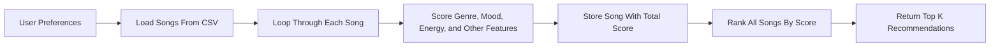

# 🎵 Music Recommender Simulation

## Project Summary

In this project you will build and explain a small music recommender system.

Your goal is to:

- Represent songs and a user "taste profile" as data
- Design a scoring rule that turns that data into recommendations
- Evaluate what your system gets right and wrong
- Reflect on how this mirrors real world AI recommenders

Replace this paragraph with your own summary of what your version does.

---

## How The System Works

Explain your design in plain language.

Some prompts to answer:

- What features does each `Song` use in your system
  - For example: genre, mood, energy, tempo
- What information does your `UserProfile` store
- How does your `Recommender` compute a score for each song
- How do you choose which songs to recommend

You can include a simple diagram or bullet list if helpful.

My recommender uses a simple content-based filtering approach. That means it recommends songs by comparing the features of each song to the user's personal taste profile, instead of using data from other listeners. In real apps, systems often combine collaborative filtering, which learns from the behavior of similar users, with content-based filtering, which focuses on the attributes of the song itself. My version prioritizes the content-based side because it is easier to understand and explain.

Each `Song` in my system uses features like `genre`, `mood`, `energy`, `tempo_bpm`, `valence`, `danceability`, and `acousticness`. The `UserProfile` stores the listener's `favorite_genre`, `favorite_mood`, `target_energy`, and whether they `like_acoustic` songs. The recommender computes a score for each song by giving the most points to songs that match the user's genre and mood, then adding smaller points when the song's energy and other vibe-related features are close to the user's preferences. After every song gets a score, the system ranks all songs from highest to lowest and recommends the top few songs with the best overall match.

- `Song` features: `genre`, `mood`, `energy`, `tempo_bpm`, `valence`, `danceability`, `acousticness`
- `UserProfile` features: `favorite_genre`, `favorite_mood`, `target_energy`, `likes_acoustic`

Example `UserProfile`:

```python
{
    "favorite_genre": "lofi",
    "favorite_mood": "focused",
    "target_energy": 0.4,
    "likes_acoustic": True
}
```

This profile is broad enough to tell the difference between something like intense rock and chill lofi. A rock song might have high energy, but it would still lose points if its genre and mood do not match the user's study-focused vibe.

Algorithm Recipe:

- Start every song at `0.0` points
- Add `+2.0` points if the song's `genre` matches `favorite_genre`
- Add `+1.5` points if the song's `mood` matches `favorite_mood`
- Add energy similarity points using `1 - abs(song_energy - target_energy)` so songs closer to the user's target earn more points
- Add a small bonus of up to `+0.75` based on how close `danceability` is to the kind of vibe the profile suggests
- Add `+0.5` if `likes_acoustic` is `True` and the song's `acousticness` is high, or if `likes_acoustic` is `False` and the song's `acousticness` is low
- Use `tempo_bpm` and `valence` as small tie-breakers when two songs feel otherwise similar
- Sort songs by total score from highest to lowest
- Return the top `k` songs as the final recommendations

Data Flow:



CLI Output Snapshot:

```text
Loaded songs: 18

Top recommendations:

Sunrise City by Neon Echo
  Score: 6.12
  Reasons: genre match (+2.0), mood match (+1.5), energy similarity (+1.47), danceability similarity (+0.74), acoustic fit (+0.41)

Gym Hero by Max Pulse
  Score: 4.46
  Reasons: genre match (+2.0), energy similarity (+1.30), danceability similarity (+0.69), acoustic fit (+0.47)

Rooftop Lights by Indigo Parade
  Score: 4.01
  Reasons: mood match (+1.5), energy similarity (+1.44), danceability similarity (+0.74), acoustic fit (+0.33)
```

Potential bias:

- This system may over-prioritize genre and miss songs from other genres that still match the user's mood
- The small dataset may make the recommender feel narrow because it cannot represent all listener tastes
- A single fixed profile can oversimplify real people, whose music preferences change by time, activity, or context

---

## Getting Started

### Setup

1. Create a virtual environment (optional but recommended):

   ```bash
   python -m venv .venv
   source .venv/bin/activate      # Mac or Linux
   .venv\Scripts\activate         # Windows

2. Install dependencies

```bash
pip install -r requirements.txt
```

3. Run the app:

```bash
python -m src.main
```

### Running Tests

Run the starter tests with:

```bash
pytest
```

You can add more tests in `tests/test_recommender.py`.

---

## Experiments You Tried

Use this section to document the experiments you ran. For example:

- What happened when you changed the weight on genre from 2.0 to 0.5
- What happened when you added tempo or valence to the score
- How did your system behave for different types of users

---

## Limitations and Risks

Summarize some limitations of your recommender.

Examples:

- It only works on a tiny catalog
- It does not understand lyrics or language
- It might over favor one genre or mood

You will go deeper on this in your model card.

---

## Reflection

Read and complete `model_card.md`:

[**Model Card**](model_card.md)

Write 1 to 2 paragraphs here about what you learned:

- about how recommenders turn data into predictions
- about where bias or unfairness could show up in systems like this


---

## 7. `model_card_template.md`

Combines reflection and model card framing from the Module 3 guidance. :contentReference[oaicite:2]{index=2}  

```markdown
# 🎧 Model Card - Music Recommender Simulation

## 1. Model Name

Give your recommender a name, for example:

> VibeFinder 1.0

---

## 2. Intended Use

- What is this system trying to do
- Who is it for

Example:

> This model suggests 3 to 5 songs from a small catalog based on a user's preferred genre, mood, and energy level. It is for classroom exploration only, not for real users.

---

## 3. How It Works (Short Explanation)

Describe your scoring logic in plain language.

- What features of each song does it consider
- What information about the user does it use
- How does it turn those into a number

Try to avoid code in this section, treat it like an explanation to a non programmer.

---

## 4. Data

Describe your dataset.

- How many songs are in `data/songs.csv`
- Did you add or remove any songs
- What kinds of genres or moods are represented
- Whose taste does this data mostly reflect

---

## 5. Strengths

Where does your recommender work well

You can think about:
- Situations where the top results "felt right"
- Particular user profiles it served well
- Simplicity or transparency benefits

---

## 6. Limitations and Bias

Where does your recommender struggle

Some prompts:
- Does it ignore some genres or moods
- Does it treat all users as if they have the same taste shape
- Is it biased toward high energy or one genre by default
- How could this be unfair if used in a real product

---

## 7. Evaluation

How did you check your system

Examples:
- You tried multiple user profiles and wrote down whether the results matched your expectations
- You compared your simulation to what a real app like Spotify or YouTube tends to recommend
- You wrote tests for your scoring logic

You do not need a numeric metric, but if you used one, explain what it measures.

---

## 8. Future Work

If you had more time, how would you improve this recommender

Examples:

- Add support for multiple users and "group vibe" recommendations
- Balance diversity of songs instead of always picking the closest match
- Use more features, like tempo ranges or lyric themes

---

## 9. Personal Reflection

A few sentences about what you learned:

- What surprised you about how your system behaved
- How did building this change how you think about real music recommenders
- Where do you think human judgment still matters, even if the model seems "smart"


## Screenshots


 
 
 
